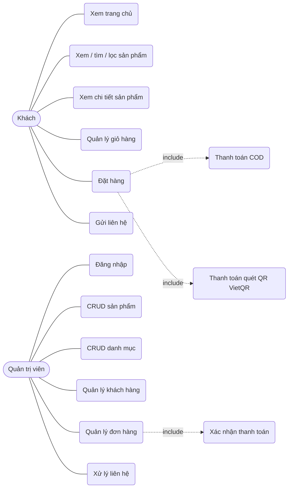
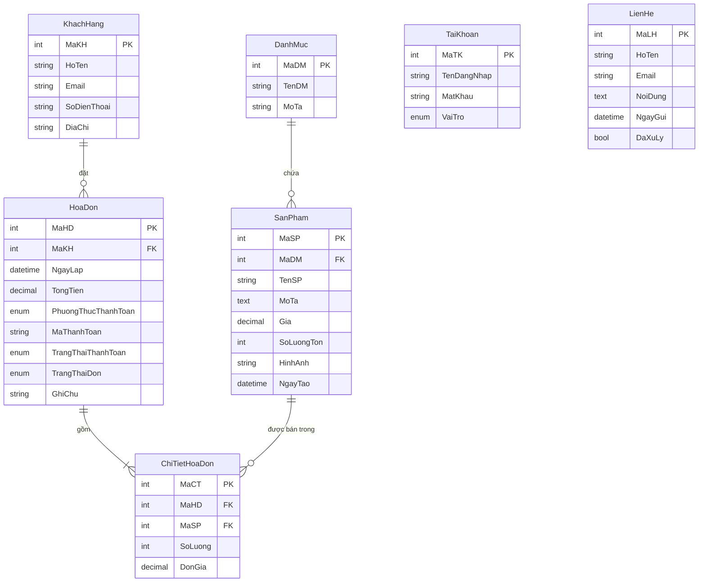

# Phân tích & thiết kế — Website bán hàng thời trang

## 1. Tác nhân và chức năng

| Tác nhân | Chức năng |
|---|---|
| Khách (không cần đăng nhập) | Xem trang chủ; xem/tìm/lọc sản phẩm; xem chi tiết; quản lý giỏ hàng; đặt hàng (COD hoặc QR); gửi liên hệ |
| Quản trị viên | Đăng nhập; CRUD sản phẩm, danh mục; xem/sửa/xóa khách hàng; xem chi tiết đơn, đổi trạng thái đơn, xác nhận thanh toán, xóa đơn; xem/đánh dấu/xóa liên hệ |

## 2. Use Case Diagram

## 3. ERD

`TaiKhoan` (tài khoản admin) và `LienHe` là hai bảng độc lập, không có khóa ngoại.

## 4. Luồng thanh toán QR

1. Khách chọn "Chuyển khoản quét mã QR" và đặt hàng.
2. Server tạo hóa đơn, gán `MaThanhToan = DH<MaHD>`, trả về link ảnh VietQR
   `img.vietqr.io/image/<BANK>-<STK>-compact2.png?amount=...&addInfo=DH<MaHD>`.
3. Khách quét bằng app ngân hàng, giữ nguyên nội dung chuyển khoản.
4. **Mức 1:** quản trị viên kiểm tra tiền về và bấm "Xác nhận đã thanh toán" ở trang Đơn hàng.
5. **Mức 2 (tùy chọn):** SePay/Casso gọi `POST /api/payment/sepay-webhook`; server tìm mã `DH<số>` trong nội dung,
   so số tiền với `TongTien`, nếu đủ thì chuyển `TrangThaiThanhToan` sang `da_thanh_toan`.
   Trang của khách hỏi `GET /api/orders/:id/status` mỗi 5 giây và tự hiện "Đã nhận thanh toán".

## 5. Danh sách API

| Method | Đường dẫn | Quyền |
|---|---|---|
| POST | /api/auth/login | công khai |
| GET | /api/categories, /api/products, /api/products/:id | công khai |
| POST/PUT/DELETE | /api/categories, /api/products | admin |
| POST | /api/orders, /api/contacts | công khai |
| GET | /api/orders/:id/status | công khai |
| GET/PUT/DELETE | /api/orders, /api/customers, /api/contacts | admin |
| POST | /api/payment/sepay-webhook | SePay (Apikey) |
